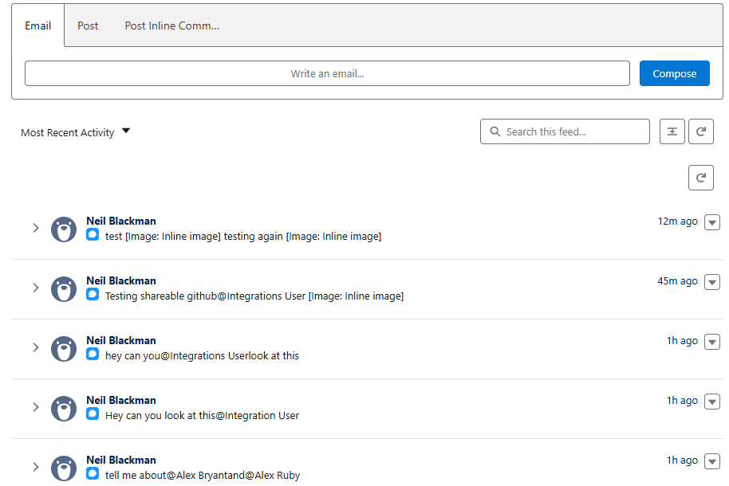

<div align="center">

# Chatter Inline Images

**Paste screenshots directly into Chatter posts. Have them render inline. In Lightning Experience.**

<sub>A working solution to a <a href="https://ideas.salesforce.com/s/idea/a0B8W00000PFdoSUAT/enable-pasting-images-in-chatter-for-lightning-experience">7-year-old IdeaExchange request</a> — without a browser extension, without <code>Click link for image</code> fallback text, without hand-rolled rta-image workarounds.</sub>

<br/>



<br/>


</div>

---

## What you get

```
paste screenshot ──▶ real Salesforce File ──▶ inline image in native Chatter feed
```

- **Paste an image** into a rich text editor anywhere in Lightning Experience → it uploads as a real Salesforce File (`ContentVersion`)
- **Post to the Chatter feed** on any record → the image renders **inline**, not as `Click link for image` text
- Works from **Screen Flows**, which means any **Quick Action** on any object
- **@mentions** with real `MentionSegment` (bell notifications and everything)
- Respects **post visibility** (`Internal Users Only` / `All with Access`)

---

## The trick, in one sentence

> Attach a `paste` listener to **`document` in the capture phase**, gate it on a focus flag tracked via `focusin`/`focusout` on the LWC host, and `preventDefault()` before `lightning-input-rich-text` ever sees the event — then upload the image bytes as a real `ContentVersion` and emit `ConnectApi.InlineImageSegmentInput` segments when the post is submitted.

Everything else in this README is context for why that single sentence is harder than it sounds.

---

## The pipeline

```
  ┌─────────────────────────────────────────────────────┐
  │  User presses Ctrl+V inside our flow screen editor  │
  └────────────────────────┬────────────────────────────┘
                           │
                           ▼
  ┌─────────────────────────────────────────────────────┐
  │ document.addEventListener('paste', h, { capture })  │
  │ runs BEFORE lightning-input-rich-text's handler     │
  └────────────────────────┬────────────────────────────┘
                           │
                    is _hasFocus set?
                   (from focusin on host)
                           │
           ┌─────── yes ───┴─── no ───────┐
           ▼                              ▼
  preventDefault() +              event passes through
  stopImmediatePropagation()      (other editors unaffected)
           │
           ▼
  read clipboardData.items → image/png blob
           │
           ▼
  @AuraEnabled Apex: insert ContentVersion → returns 069… Id
           │
           ▼
  insert 
  into richTextValue  (flow variable)
           │
           ▼
  on Submit: flow passes HTML to invocable action
           │
           ▼
  SegmentWalker regex-parses  + <a href>,
  emits [Text, InlineImage, Text, Mention, Text] in document order
           │
           ▼
  ConnectApi.ChatterFeeds.postFeedElement(null, feedItemInput)
           │
           ▼
       ┌────────────────────────────┐
       │   Inline image renders     │
       │   in the native Chatter    │
       │   feed.                    │
       └────────────────────────────┘
```

---

## Why this is hard

Five dead ends you'll hit before you figure this out. Click to expand.

<details>
<summary><strong>Dead end 1 — <code>FeedItem.Body</code> is a plain textarea</strong></summary>
<br/>

You can't just drop `` tags into a `FeedItem.Body` and have them render. It's a plain text field. Any HTML you put there gets stripped. This is why hand-rolled flows end up with `"Click link for image: https://..."` text instead of rendered images.

</details>

<details>
<summary><strong>Dead end 2 — <code>lightning-input-rich-text</code> intercepts pasted images as rta-images</strong></summary>
<br/>

When you paste an image into `lightning-input-rich-text`, Salesforce's component catches the paste and uploads the image to `/servlet/rtaImage?refid=0EM...`. Those URLs:

- **Are not** real `ContentDocument` records
- **Cannot** be referenced by `ConnectApi.InlineImageSegmentInput`, which requires a `069...` `ContentDocumentId`
- **Don't render** reliably across users and sessions

So even if you find the ConnectApi inline image docs and think *"aha, just pass the refid"*, it doesn't work. The rta-image system is a different, older mechanism that ConnectApi ignores.

</details>

<details>
<summary><strong>Dead end 3 — Trying to upload the rta-image bytes yourself</strong></summary>
<br/>

You might think *"ok, I'll fetch the bytes from the rtaImage URL server-side and re-upload as a `ContentVersion`."*

**It doesn't work.** The `/servlet/rtaImage` endpoint returns `404` from `PageReference.getContent()` even with a valid session — the rta-image system expects an `eid` parameter tied to the original browser session, and the image is only accessible from the same client context that created it.

</details>

<details>
<summary><strong>Dead end 4 — Intercepting the paste in the LWC's own handler</strong></summary>
<br/>

You'd think attaching a `paste` listener to your LWC's container div would let you catch the image before Salesforce's handler runs.

**It doesn't.** Salesforce's `lightning-input-rich-text` has its own internal `ql-clipboard` div inside its shadow DOM that catches the paste before it bubbles up to your component. Your handler never fires.

</details>

<details>
<summary><strong>Dead end 5 — Using <code>composedPath()</code> to identify the paste target</strong></summary>
<br/>

Once you move the listener to `document` in the capture phase, the next instinct is to use `event.composedPath()` to check whether the paste targeted your editor.

**It doesn't work either.** Lightning Web Security retargets composed event paths at the outermost shadow root, so `composedPath()` stops at `ONE-RECORD-HOME-FLEXIPAGE2`. Your LWC, the rich text component, and everything inside are invisible.

This package works around it by tracking focus state via `focusin`/`focusout` on the host element instead — those *are* composed events that reach your LWC across shadow boundaries, giving us a reliable "is the paste for us?" signal without touching the event path at all.

</details>

---

## How this package solves it

1. **`document`-level `paste` listener in the capture phase** (`{ capture: true }`). Capture runs top-down before any descendant's handler, so it runs before `lightning-input-rich-text` sees the event.

2. **Focus tracking on the LWC host** via `focusin`/`focusout`. These are composed events that cross shadow root boundaries and reach our host element from inside the shadow DOM. The document-level paste handler checks a `_hasFocus` flag instead of inspecting `event.target`, which bypasses the Lightning Web Security composed-path retargeting problem.

3. **When a paste with an image fires and focus is in our editor:**
   - `preventDefault()` + `stopImmediatePropagation()` — kills the event before Salesforce's rta-image upload runs
   - Read the image binary from `clipboardData.items`
   - Upload it as a real `ContentVersion` via an `@AuraEnabled` Apex method
   - Get back a `069...` `ContentDocumentId`
   - Insert an `` tag into the editor value

4. **Why the `ContentDocumentId` lives in the `src` URL, not a `data-*` attribute.** Quill (the editor backing `lightning-input-rich-text`) strips custom `data-*` attributes during sanitization but preserves `src` unchanged. Encoding the Id in the src is the only way to survive the round-trip through the editor.

5. **On Submit**, the HTML is passed to an invocable Apex action. A forward-walking segment builder parses `` tags and `<a href="/005...">` anchors in document order, extracts `069...` Ids from each src, and emits `ConnectApi.InlineImageSegmentInput` + `ConnectApi.MentionSegmentInput` message segments.

6. **`ConnectApi.ChatterFeeds.postFeedElement()`** creates a real `FeedItem` with native inline images that render for all viewers.

---

## Components

| Component | Type | Purpose |
|---|---|---|
| `ChatterInlineImagesController` | Apex `@AuraEnabled` | Uploads pasted images as `ContentVersion` records, resolves user/group names for the mention picker. |
| `ChatterInlineImagePoster` | Apex `@InvocableMethod` | Parses rich text HTML, builds ConnectApi message segments (text + inline image + mention), posts the FeedItem. |
| `chatterImageEditor` | LWC (Flow Screen) | Rich text editor with document-level paste capture, focus tracking, and optional mention picker. |
| `Chatter_Inline_Image_Post_Demo` | Flow | Minimal 2-element demo (Screen → Post to Chatter). |
| `Post_Inline_Comment` | Quick Action (Case) | Launches the demo flow from a Case page. |

Plus two Apex test classes (`ChatterInlineImagesControllerTest`, `ChatterInlineImagePosterTest`) with **25 tests** covering parsing, error paths, and a full ConnectApi end-to-end post with a real inline image.

---

## Install

**Prerequisites:** Salesforce CLI (`sf`), an authenticated org (sandbox recommended for first install).

```bash
git clone https://github.com/neilcorp2kx/salesforce-ChatterInlineImages.git
cd salesforce-ChatterInlineImages
sf project deploy start --manifest manifest/package.xml --target-org <your-org-alias>
```

**Run the tests:**

```bash
sf apex run test \
  --class-names ChatterInlineImagesControllerTest \
  --class-names ChatterInlineImagePosterTest \
  --target-org <your-org-alias> \
  --result-format human \
  --wait 10
```

**Wire up the demo Quick Action on Case:**

1. **Setup → Object Manager → Case → Page Layouts**
2. Edit your layout, find the **Mobile & Lightning Actions** section
3. Drag **Post Inline Comment** into the **Salesforce Mobile and Lightning Experience Actions** area
4. Save

Open any Case → click **Post Inline Comment** → the flow launches in a modal → paste a screenshot → post.

---

## Adapt to other objects

The flow is object-agnostic — it uses `{!recordId}` from flow context. To add the action elsewhere:

1. **Setup → Object Manager → [Your Object] → Buttons, Links, and Actions**
2. **New Action** → Action Type: **Flow** → Flow: **Chatter Inline Image Post Demo** → label whatever you want
3. Add the action to the page layout

---

## LWC properties

The `chatterImageEditor` LWC exposes these flow screen properties:

| Property | Type | Default | Purpose |
|---|---|---|---|
| `recordId` | String | *(required)* | The record to link uploaded images to and post the FeedItem on |
| `label` | String | `Comment` | Field label above the editor |
| `placeholder` | String | `Type your comment here…` | Placeholder text |
| `required` | Boolean | `false` | Block Next/Finish if the editor is empty |
| `disableAdvancedTools` | Boolean | `false` | Show only basic formatting in the toolbar |
| `hideVisibilitySelector` | Boolean | `false` | Hide the `To` dropdown |
| `hideMentionButton` | Boolean | `false` | Hide the Mention button if you don't want mention support |
| `defaultVisibility` | String | `InternalUsers` | `InternalUsers` or `AllUsers` |
| `richTextValue` | String | *(output)* | HTML to pass to subsequent flow elements |
| `selectedVisibility` | String | *(output)* | The user's visibility choice |

---

## Known limitations

> **Pasted images append at the end of the editor, not at cursor position.**
> We block Quill's paste handler entirely, so Quill has no idea about the image — it just sees the updated `richTextValue` and re-renders. Mentions *do* insert at cursor position via `execCommand`.

> **Mention picker uses a button, not inline `@` typeahead.**
> Inline typeahead would require hooking into Quill's internal change events and positioning an overlay at the caret, which is painful across shadow DOM boundaries. The button + record picker is 1/5 the work.

> **Stability note.**
> The focus-tracking + capture-phase approach doesn't depend on any internal Salesforce APIs, so it should be stable. If Salesforce ever changes how `lightning-input-rich-text` dispatches paste events, this could break.

> **External visibility.**
> If you post with `AllUsers` visibility, uploaded images need their `ContentDocumentLink.Visibility` set to `AllUsers` too. The invocable does this automatically.

> **No drag-drop yet — paste only.**

---

## Credits

Built by **[Neil Blackman](https://github.com/neilcorp2kx)** after discovering the idea still wasn't delivered 7 years after it was first filed. Built with [Claude Code](https://claude.com/claude-code).

Shared back to the community with the hope that nobody else has to rediscover the rta-image / ConnectApi / Quill sanitization / Lightning Web Security path-retargeting maze.

## License

**MIT** — see [LICENSE](LICENSE).
